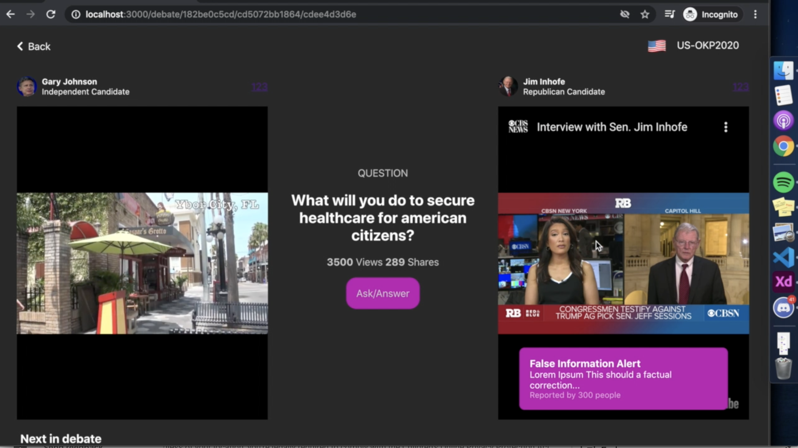

## United Poll

United Poll is a web app that provides users to curate debates between policy makers no matter their affiliation by embedding their candidate’s 30 second YouTube clips in response to questions on the website. Users can then compare and contrast different viewpoints, policies and proposals in a more systematic way so as to make better electoral decisions.

Second part of the project is a crowdsourced annotation tool — that allows users to annotate segments of clips with factual corrections, reports, analyses, comparisons to previous works and so on.
[Learn more](https://devpost.com/software/united-poll)

## Video Demo

https://www.youtube.com/watch?v=YPoXEd2MWXE

## Instructions

### Download the repository

    git clone https://github.com/parthraghav/United-Poll United-Poll
    cd United-Poll

### Start Development Server

    yarn install
    yarn start
    yarn build

## Milestones

The project was made at the RiceHacks Hackathon. Following are some of the upcoming milestones:

- [ ] Make a data aggregator automate the process of CRUD candidates in the database.
- [ ] Once we have enough candidate data in the future, I want to provide users a tool to set up filters to be matched with the candidate that most aligns with them.
- [ ] Add cool-down functionality to prevent bots from spamming the app.
